# The Tools I Use to Learn Japanese

Hello, world! To start off the blog section, I wanted to do a bit of a deep dive into the sites, tools, and resources I used/currently use to study Japanese. We'll start with kanji resources, then look at grammar, vocab, and immersion resources, before tying up any loose ends.

What works for me might not work for you, and I'm sure that there are many useful Japanese learning resources out there that I'm missing out on. Ultimately, it's a <code>十人十色</code>-type situation, so remember that what's important is finding resources that work for *you*.[^1]

[^1]: If you happen to know of any Japanese learning resources that I might be interested in, please, feel free to let me know!

::: tip
**十人十色** (じゅうにんといろ) — Different strokes for different folks ; everyone has their own ideas, interests, etc.
:::

## 漢字 — Kanji

As the first step on this thousand mile journey, let's start by tackling some resources for learning kanji.[^2] It might seem odd to deal with kanji first, but I have my reasons for doing so, which will be discussed shortly.

::: warning
**千里の道も一歩から** (せんりのみちもいっぽから) — The journey of a thousand miles begins with a single step.
:::

[^2]: The zeroth step is memorizing hiragana and katakana, but I leave finding kana resources as an exercise for the reader.

### Remembering the Kanji + Kanji Koohii

James Heisig's [Remembering the Kanji](https://en.wikipedia.org/wiki/Remembering_the_Kanji_and_Remembering_the_Hanzi) (RTK) is a three-part book series dedicated to remembering the meanings and readings of ~3,000 kanji. That may sound like a *lot* of Chinese characters to remember, but in my experience, the time I invested into RTK was very much worth it.

The first and third volumes of RTK focus on remembering the *meaning* of kanji, whereas the second volume focuses on remembering the *readings*. In the beginning, I think it's best to simply focus on getting the meaning down—worrying about the readings can come later. As you start to come across kanji in the wild, you'll naturally pick up the readings, anyways. That is to say that I think the second volume is not very useful.

RTK works by assigning a **keyword** to each kanji, which is related to its semantic meaning. For example, the keyword for **切** is **cut**, and for most intents and purposes, when this kanji appears, it does in fact mean something along the lines of "cut". Kanji and keywords are one to one, so each kanji gets one unique keyword.[^bignote]

[^bignote]: Keywords can get confusingly similar, though—the keyword for **気** is **spirit**, and the keyword for **霊** is **spirits**. Yes, they mean completely different things. 

    Some keywords will also test your English. For example, the keyword for **坤** is **authochthonous**. I had never seen this word before studying RTK.

To actually form this keyword to kanji association in your brain, however, Heisig employs the use of mnemonics, or **stories**. Essentially, the kanji 切 is actually made up of two separate kanji, those being **七**, meaning **seven**, and **刀**, meaning **sword**. Unlike 切, these two kanji cannot be further broken down, so we can think of them like building blocks.

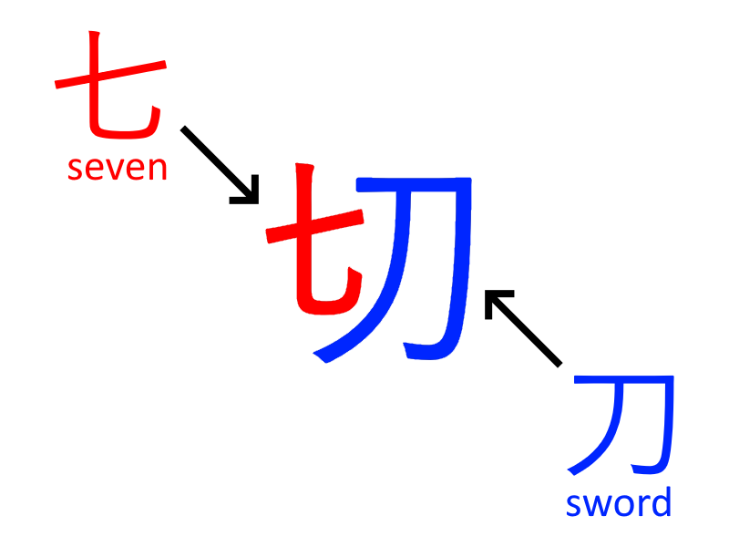

The point of the story is to help you remember what the constituent parts of each kanji are. For example, a story for 切 might be something like <code>seven swords cut the ribbon</code>. But what's important is to make a story that's *memorable*. 

Something along the lines of <code>seven swords cut into my flesh</code> is far less pleasant, but if that mental image is easier to remember, then why not go with that? Ultimately, you just want to be able to remember that the kanji which means "cut" is made up of the kanji for "seven" and the kanji for "sword". Now do that another 2,999 times...

There's a lot more to be said about RTK, but that's the gist of how it works. Now, I'd like to mention one of my favorite resources, which I've been using almost daily for over two years.

[Kanji Koohii](https://kanji.koohii.com/) is a website that takes the ideas of RTK and adapts them into a visually appealing and easy-to-use online format. I give my deepest thanks to the developer, Fabrice, who has been maintaining this site for nearly two decades. 

In my opinion, Kanji Koohii has three main features which make it much more efficient to use in comparsion to the original books:
* The ability to share and view other users' stories,
* A spaced repetition flashcard system for long-term memory, and
* A quick kanji-to-keyword (or vice versa) search bar.

Below is what it looks like when you study a kanji with Kanji Koohii. At the top is the keyword and the story, and then below that, you can see stories which other users have created and shared.

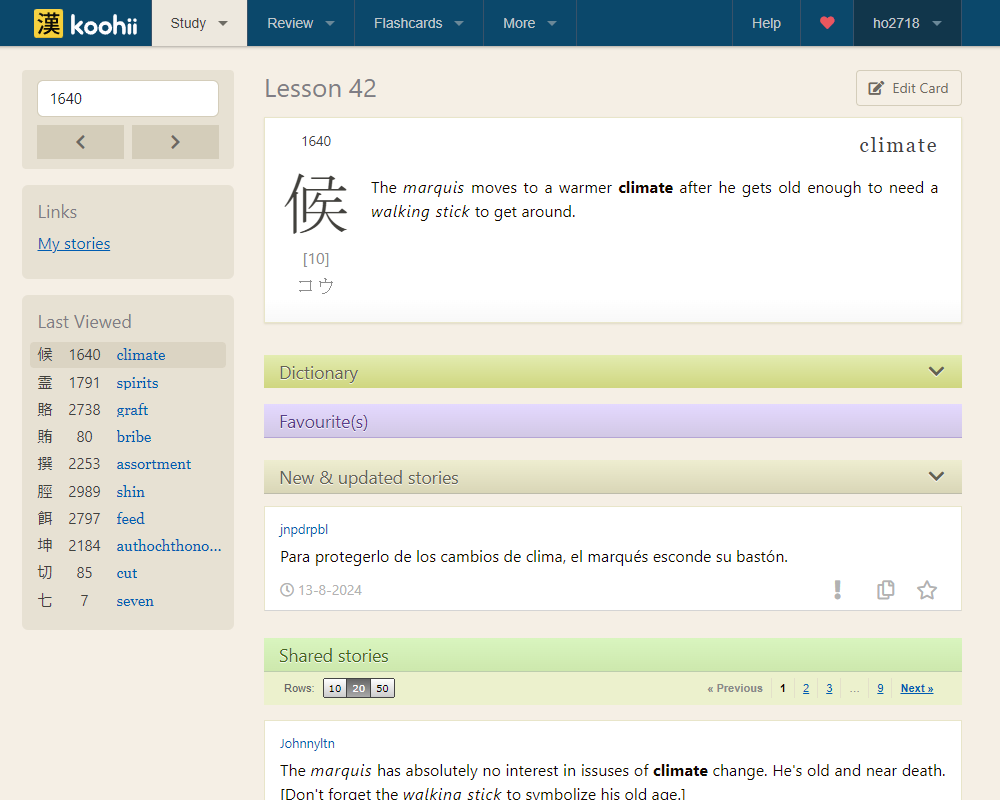

You can learn more about those features through the Kanji Koohii [help](https://kanji.koohii.com/learnmore) page, which I definitely think is worth a read if what I've mentioned interests you.

Now, most Japanese learners pick up kanji as they go, but I decided to really focus on getting down the meanings and stroke orders of kanji from the get-go. While this does make the beginning of your thousand-mile Japanese journey more aruduous, I believe the payoff you'll experience later down the road more than makes up for the time and effort invested.

That benefit isn't really something that can be well described, so you may just have to find out for yourself..!

### Kanji Kentei Prep Resources

The [日本漢字能力検定](https://www.kanken.or.jp/kanken/), also known by its shorter appellation, the <code>漢字検定</code> (or **Kanji Kentei**/**Kanken** in English), is an exam that tests kanji proficiency. Questions involve a mix of multiple choice and short answer, and being able to write kanji neatly is a *must*. If you wish to know more, Tofugu has a well-written [overview](https://www.tofugu.com/japanese/kanji-kentei/) of the Kanken, which provides more background and context.

The Kanji Kentei is a *hard* exam—only about 20% of people pass the 2級, or 2 Kyu level, which is mainly taken by university students and adults. Unsurprisingly, there are quite a few study books out there for those who wish to make a serious effort in studying for the Kanken.

After buying some of these study books and working through them, I think that even if you aren't looking to take the exam, studying the questions in these prep books will seriously help develop your Japanese proficiency. However, I do want to note that the barrier of entry to use these books is quite high—you'd want to be at *least* N2 level, maybe even N1 level. 

The Kanken study books which I really enjoyed are [this one](https://www.amazon.co.jp/-/en/gp/product/4010924543/ref=ppx_yo_dt_b_asin_title_o04_s00?ie=UTF8&psc=1) (pictured below), [this one](https://www.amazon.co.jp/-/en/gp/product/4816369198/ref=ppx_yo_dt_b_asin_title_o04_s00?ie=UTF8&psc=1), and [this one](https://www.amazon.co.jp/-/en/gp/product/4890964886/ref=ppx_yo_dt_b_asin_title_o04_s00?ie=UTF8&psc=1).

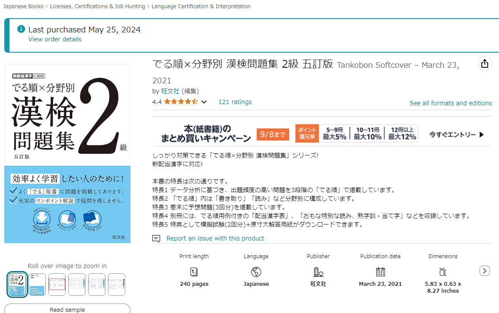

At the 2級 level, the kanji and vocabulary appearing in the exam is what you'd see in native Japanese content, but not in day to day conversations. Instead, I think you'd find that these words appear in things such as legal documents and prose/novels.

If you love kanji like me, definitely consider taking a look![^4]

[^4]: I plan to take the 2級 exam in January or February next year...please wish me luck—I'll need it!

### 漢字でGO!

The last kanji learning resource which I'd like to discuss is actually a video game, developed by rhythm game artist and multimedia extraordinaire [Micelle](https://x.com/t3n3bra3). It's called <code>漢字でGO!</code>, and it tests your ability to translate kanji into kana. You may have seen VTubers or content creators play this game before, as it's actually become quite popular since its debut.

You can check out the game [here](https://plicy.net/GamePlay/155561) (warning: entirely in Japanese), or watch [this guy](https://www.youtube.com/watch?v=J5yZWfLsnAE) give it a try (warning: also entirely in Japanese).[^5] As you might be able to tell from the man's playthrough, even Japanese natives are stumped when it comes to the trickier questions. 

[^5]: Unsurprisingly, there's not a lot of anglophones playing this game.

What I like to do is try a few attempts on Hard or Hard+ mode, and add questions that I missed to an Anki deck. There are also modes where you can challenge questions of certain types, such as place names or yojijukugo. 

Below is a screenshot of what gameplay looks like—the kanji in question are in big yellow letters, and my answer (in hiragana) is below, in the text input field.

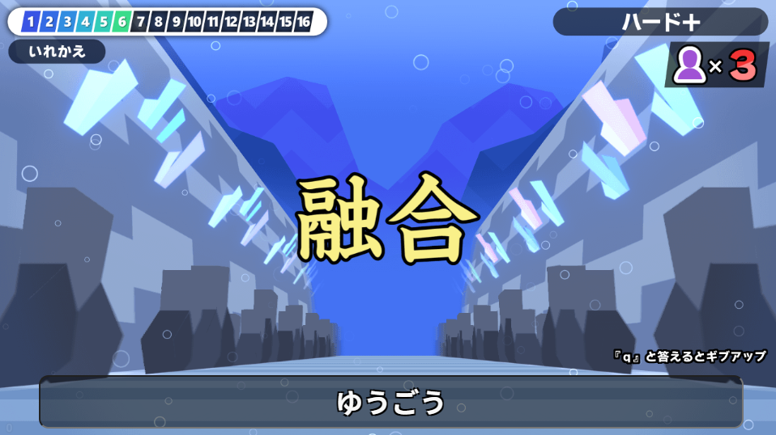

If you are an intermediate/advanced learner and want to test your kanji ability, it's definitely worth a try.

## 文法 — Grammar

While a lot of vocab and kanji practice might come down to rote memorization, I think grammar is a tad more tricky, as there are lots of conjugations and idiomatic constructions which learners need to keep an eye out for.

Below, I'll discuss the resources which were key in improving my proficiency in Japanese grammar.

### Bunpro

Around the same time that I started using RTK and Kanji Koohii, I also became aware of a site called [Bunpro](https://bunpro.jp). It's an all in one grammar learning site where you can study grammar points, view example sentences, and strengthen your long-term retention via their built-in **spaced repetition system (SRS)**.[^6]

[^6]: You can read more about SRS [here](https://en.wikipedia.org/wiki/Spaced_repetition)—thanks, Wikipedia!

Below is an example of the Bunpro interface, which I think is very well-made. The grammar point in question is shown at the top, with details on its structure and usage following after.

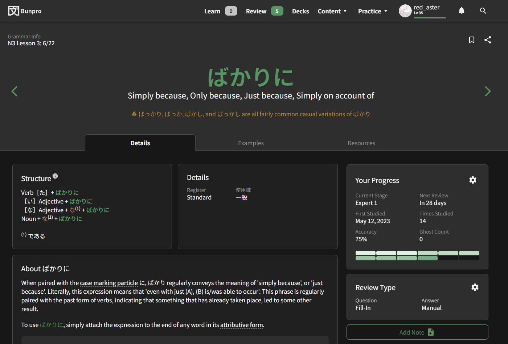

There's a free plan and a premium plan—I've been subscribed to the premium plan for about two years now, and I don't regret a single penny (or dollar, etc.) spent. 

Personally, I would say that Bunpro has been the single most helpful resource for improving my grammar, and unlike some of the other resources I've mentioned, it's very beginner friendly! Please do check it out if you're interested.

### Dictionary of Japanese Grammar Reference

The <code>A Dictionary of Japanese Grammar</code> series, authored by Seiichi Makino (牧野 成一) and Michio Tsutsui (筒井 通雄), is a *very* comprehensive grammar resource. This Tofugu [review](https://www.tofugu.com/reviews/dictionary-of-basic-japanese-grammar/) gives the books a 9.5/10 rating, and honestly, I'm inclined to agree.

I think if you can get through all the grammar points in these dictionaries, your grammar will be in very great shape. For those looking to obtain physical copies, the books *are* a little pricey, so in exchange, I offer you this handy [online reference](https://gohoneko.neocities.org/grammar/dojg/dojgall).

I like to browse through 2 or 3 entries every day. Across the three dictionaries, there are a few *hundred* grammar points to get through, so I think this should leave the average Japanese learner occupied for quite some time.

### Monolingual Grammar Resources

The above grammar resources are primarily written in English and intended for anglophone audiences, but if you are confident in your Japanese, then I highly recommend you turn your attention to **monolingual** resources—that is, resources written entirely in Japanese (and that are intended for a native Japanese audience).

One immediate benefit of using monolingual resources is that you can practice your reading comprehension while learning grammar at the same time, which may make for a more efficient learning experience.

::: tip
**一石二鳥** (いっせきにちょう) — Killing two birds with one stone ; One stone, two birds [literal translation].
:::

To round out the grammar section of this blog post, I'll list some monolingual grammar resources which I consult from time to time:
* [初級を教える人のための日本語文法ハンドブック](https://www.amazon.co.jp/-/en/%E5%BA%B5%E5%8A%9F%E9%9B%84-ebook/dp/B07G1W9C9X),
* [日本語教師を応援するTomo塾](https://www.tomojuku.com/blog/) (pictured below), and
* [国語の文法](https://www.kokugobunpou.com/).

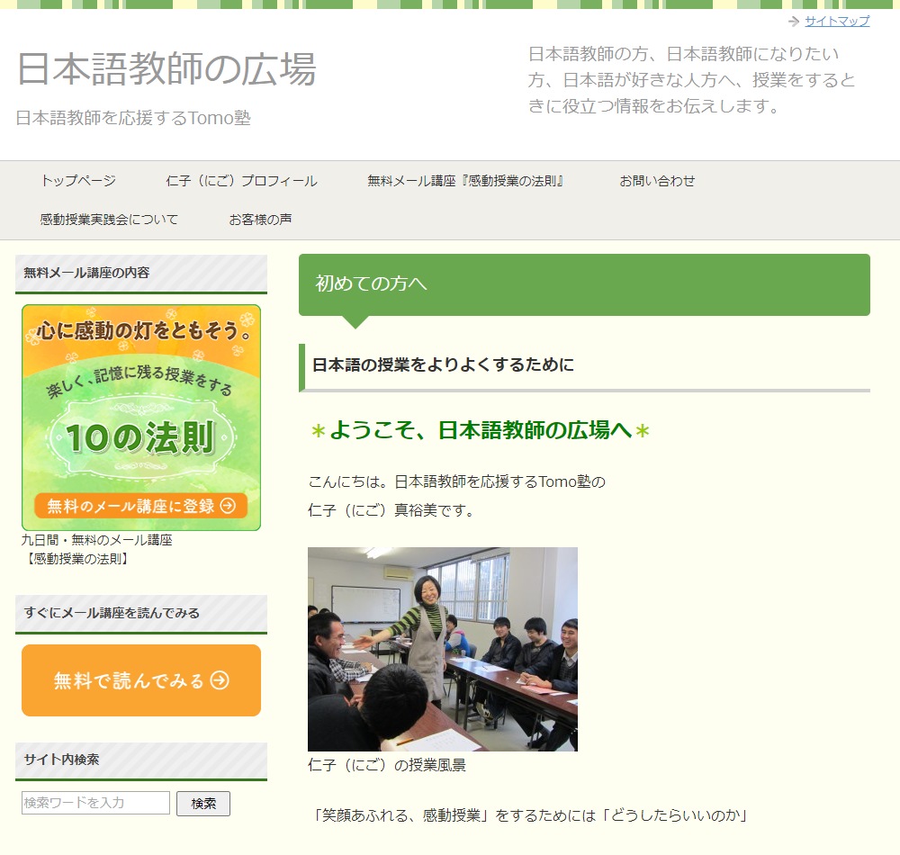

If you want to practice your reading comprehension and take your grammar to the next level, please give these resources a look!

## 語彙 — Vocabulary

And last but not least, we have everyone's favorite, vocabulary. 

It's no secret that a good foundation in kanji can actually go a long way in terms of building your Japanese vocabulary. For example, <code>漸増</code> and <code>逓増</code> are words that both mean <code>gradual increase</code>, but their nuances are slightly different. The difference is in the meaning of the leading kanji—**漸** roughly means **steadily**, and **逓** means something like **in turn**.

For all practical purposes, <code>漸増</code> and <code>逓増</code> are interchangeable, but there *is* a slight difference! Being perceptive to these subtle nuances is definitely one of the keys to improving **語彙力** (literally, **vocabulary power**).

Let's look at some resources which helped me boost my vocab.

### Core 6k Anki Deck

[Anki](https://apps.ankiweb.net/) is a flashcard software which uses SRS to help optimize retention and long-term memory. If you've been in the Japanese learning scene for a while, then you've *definitely* heard of Anki, and you've probably also heard of the Core Anki decks.

In the case of the [Core 6k](https://ankiweb.net/shared/info/1607129785) deck, the deck consists of 6000 vocabulary flashcards, featuring native pronounciation audio. If you learn new cards at a rate of 20 or so per day, then you'll finish the whole deck in under a year. 

Below is an example of what using the deck looks like in Anki.

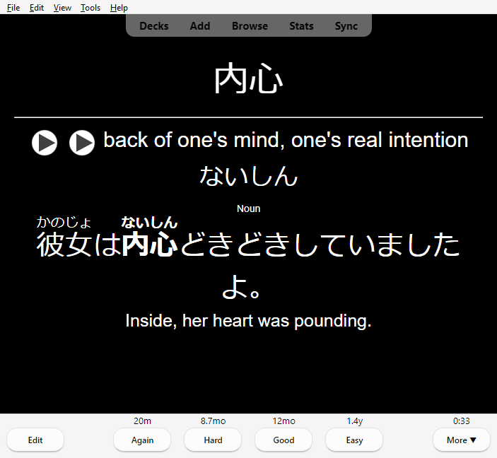

Getting through this deck should massively boost your reading and listening abilities, and I believe that it's definitely worth the time investment.

### Bret Mayer's "Kanji Stuff"

[Bret Mayer](https://tedxhamamatsu.com/en/speakers/bret-mayer/) is a man who can only be appropriately described as a kanji god. He's passed the 1級 level of the Kanken, which is a *ridicuously* hard feat, especially for someone who isn't Japanese.[^7]

[^7]: The Kanken 1級 level is the hardest level offered, and requires mastery of some 6500-odd kanji. In the decades-long history of the Kanken, there have only been a handful of non-Japanese test-takers who have passed the 1級 exam.

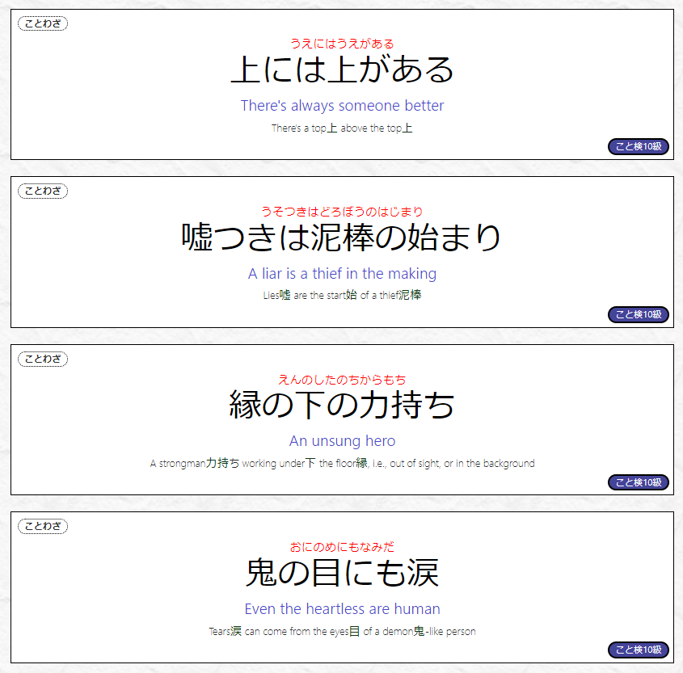

On his [website](https://www.bretmayer.com/) (shown above), he has extensive lists of yojijukugo and kotowaza, among other nifty things. If you want to learn a new expression or become a kanji nerd, this is the site for you.

### Sentence and Vocabulary Mining 

Personally, I think mining is one of the most efficient ways to improve vocab. The idea behind mining is that, when you're consuming Japanese content and you come across a word or phrase that you don't know, you make an Anki card for it and add it to a deck. This way, all the words you didn't know will eventually make it into your long-term memory.

There are tools that can help assist with mining, such as Yomitan, or text hookers for visual novels.[^8] However, my setup is much more old-fashioned. If I encounter vocab I don't know, then I look it up using a [monolingual dictionary](https://www.weblio.jp/) and manually make a new card in Anki.

[^8]: [TheMoeWay](https://learnjapanese.moe/yomichan/) has good tutorials for how to setup these tools, but I must warn you in advance that the site is disastrously weeb-pilled.

I think that sentence and vocabulary mining has a ton of perks, but I don't want to get too deep into specifics. If you want to learn more, I urge you to search for <code>Japanese sentence mining</code>, and whatever videos appear will probably do just fine (probably).

## Immersion

The idea of immersion is one that's talked about often in Japanese learning communities, but what exactly is it? Well, as per *my* definition, immersion is the act of consuming native Japanese content. That's basically it.

In this section, I want to discuss the Japanese content which I personally enjoy, and which helps me gain exposure to the language.

### E-books (Novels, Textbooks, etc.)

For my birthday last year, I was gifted an Amazon Kindle, and I must say that it's become an indispensable part of my day-to-day life. While I do have some minor gripes (the refresh rate is *terrible*), I personally enjoy reading on it much more than I would reading on my phone or laptop.

As for what I've been reading on my Kindle, it mainly falls into the four categories below (and I've given some examples in each genre):
* Mystery novels ([硝子の塔の殺人](https://www.amazon.co.jp/-/en/%E7%9F%A5%E5%BF%B5-%E5%AE%9F%E5%B8%8C%E4%BA%BA-ebook/dp/B098TC8BN4/), [方舟](https://www.amazon.co.jp/-/en/%E5%A4%95%E6%9C%A8%E6%98%A5%E5%A4%AE-ebook/dp/B0DBH95SGW/)—pictured below),
* Light novels ([今日も生きててえらい！](https://www.amazon.co.jp/gp/product/B09R9D2DSJ/)),
* Mahjong strategy books ([超メンゼン主義麻雀](https://www.amazon.co.jp/gp/product/B07SRG3F4X/), [絶対にラスを引かない麻雀](https://www.amazon.co.jp/gp/product/B01C3PNVJ6/)), and
* Books about the Japanese language itself ([語彙力を鍛える](https://www.amazon.co.jp/gp/product/B01GR89GYO/), [日本語の作文技術](https://www.amazon.co.jp/gp/product/B01MYXH4J1/)).

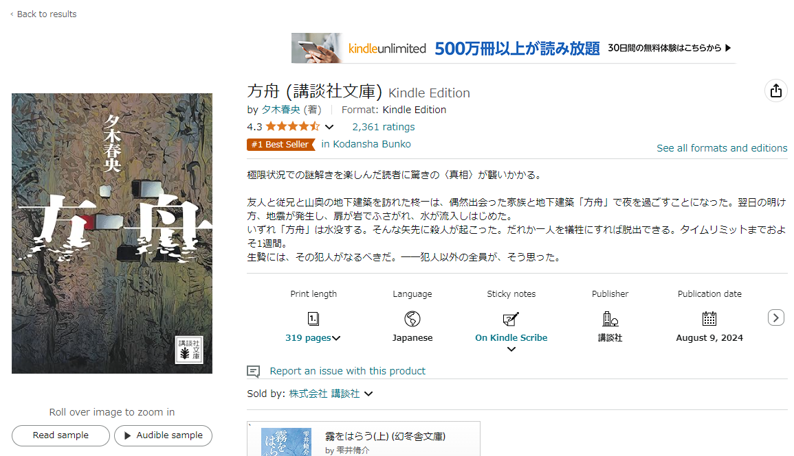

Of course, there's quite the barrier to entry when it comes to being able to enjoy books entirely in Japanese, but you can instead think of it as one of the perks of improving your Japanese—you'll be able to read more native content and do so faster, too!

To keep tracks of the books I've read, I use the [読書メーター](https://bookmeter.com) website, ran by KADOKAWA. Here, you can add books to collections, write impressions/reviews, and so on (home page shown below). At the time of writing, I've finished 43 books and logged over 10,000 pages.

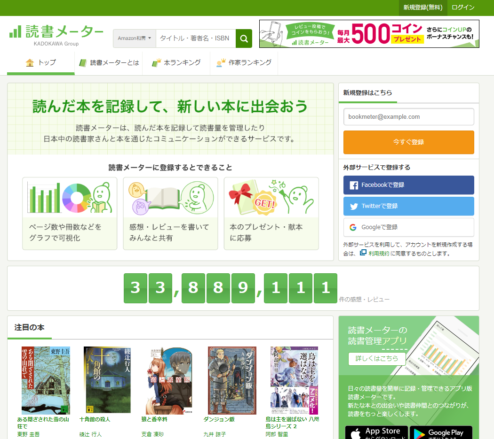

Reading is a highly efficient way to improve vocab and grammar, and there's content out there for all skill levels, so why not crack open a book (or read blog posts, etc.) from time to time?

### Livestreams, YouTube Videos, etc.

In this blog's [About](./about.md) page, I mentioned that one of my hobbies is Japanese (Riichi) Mahjong. As a Japanese learner, one big benefit of having Japanese hobbies is that you can enjoy native content while getting your immersion in at the same time.

When I want to enjoy some Mahjong content in Japanese, I usually tune into the livestreamed games, which are ran by professional Mahjong organizations (example pictured below). You can watch skilled players duke it out over the table—usually for free, but VODs may sometimes be locked behind YouTube memberships.

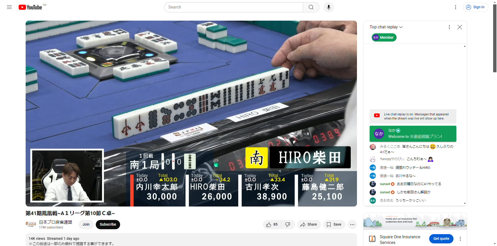

In addition to livestreamed games, there's also strategy videos, VTuber livestreams, etc. If you have any Japanese-related hobbies, then I'm sure there's content out there that'll interest you—but no guarantees.

## Miscellaneous

Lastly, I wanted to cover some miscellaneous resources that really helped me over my Japanese learning journey (of a thousand steps). These resources don't really focus on a single specific aspect of Japanese, but nevertheless, I believe that they're invaluable to any aspiring learner.

Now, as with any hobby, if you're working on it all by yourself, things can get a bit lonely, and it might be hard to stay motivated. For this reason, I think that joining a Japanese learning community is really helpful, as you can discuss your progress and thoughts with people in the same (proverbial) boat as you.

I'm fortunate to be part of a tight-knit community of Japanese learners, and we often talk about topics such as how much time we spent immersing over the week, what kind of content we've recently been enjoying, and so on. I think this kind of mutual discussion is very encouraging, and it helps me stay motivated.

::: tip
**切磋琢磨** (せっさたくま) — Mutually encouraging each other to study, train, etc.
:::

Other resources which I've made (and continue to make) use of include:
* University lectures — these are really great for practicing your output skills, as you will be expected to speak and write quite frequently!
* Private tutors — A good tutor can go a long way! If you don't mind online tutoring, [italki](https://www.italki.com/) is a great place to find an online tutor.

### Resources Which I Don't Use, but...

Two resources which I've heard good things about, but don't personally use, are [IMABI](https://imabi.org/) (pictured below) and [WaniKani](https://www.wanikani.com/). 

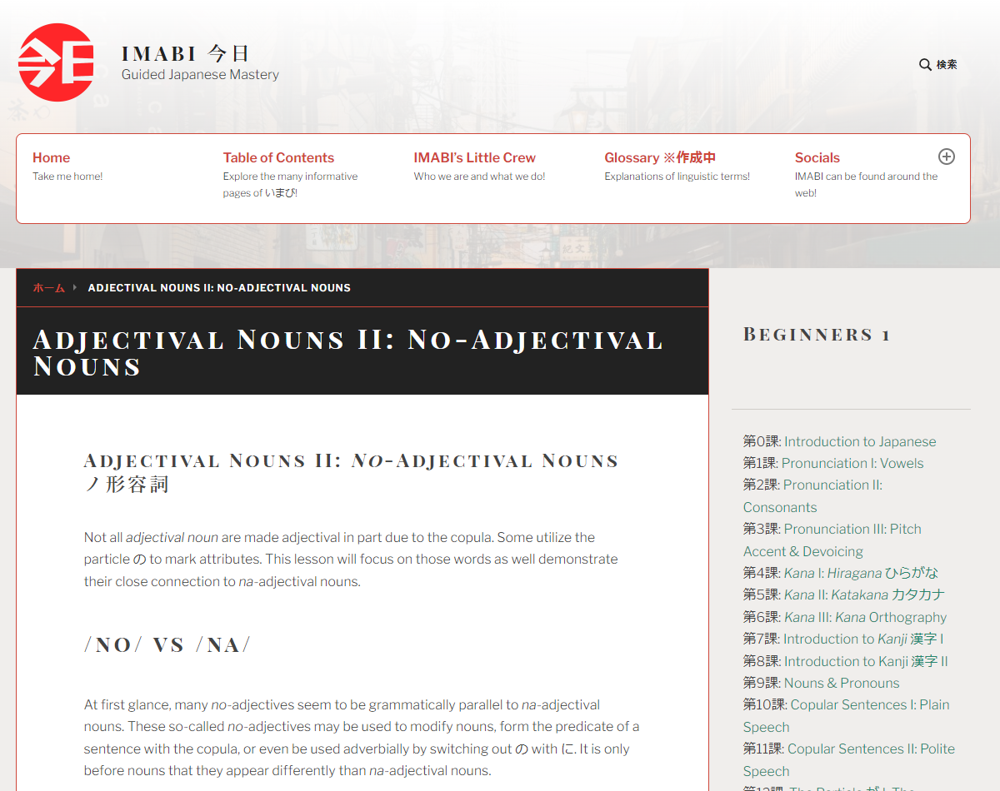

IMABI is an all-in-one resource, primarily covering grammar. The main reason why I don't use it is because the explanations are very, *very* in-depth. If you really want to get into the weeds, then I think this is a great resource, but for the rest of us, something simpler might be better.

In contrast, WaniKani is a kanji and vocbulary site which uses a method very similar to Heisig's RTK. The main reason why I don't use it is because it costs money, and in contrast, Kanji Koohii is free! But of course, there are differences, and you might prefer the former, which is perfectly fine.

### Closing Remarks

As I mentioned in the introduction, these resources which I've listed are nothing more than what worked for me, and your mileage with them may vary. But of course, you won't know if something works for you until you try, so if anything I've mentioned here interests you, I implore you to take a look.

::: warning
**物は試し** (ものはためし) — Everything is worth a try ; you never know unless you try.
:::

That's all from me for now! This post was a bit long—I anticipate that going forward, posts will be shorter (but who knows). For the next post, I'm thinking of covering either some interesting yojijukugo, or grammar. <code>乞うご期待</code>—please look forward to it!

### Image Sources

From the top image, going down:
* Made in-house,
* Kanji Koohii,
* Amazon.jp,
* 漢字でGO!,
* Bunpro,
* 日本語教師を応援するTomo塾,
* Anki/Core 6k Optimized Japanese Vocabulary,
* ぶ先生.com,
* Amazon.jp,
* 読書メーター,
* Youtube/日本プロ麻雀連盟,
* IMABI
