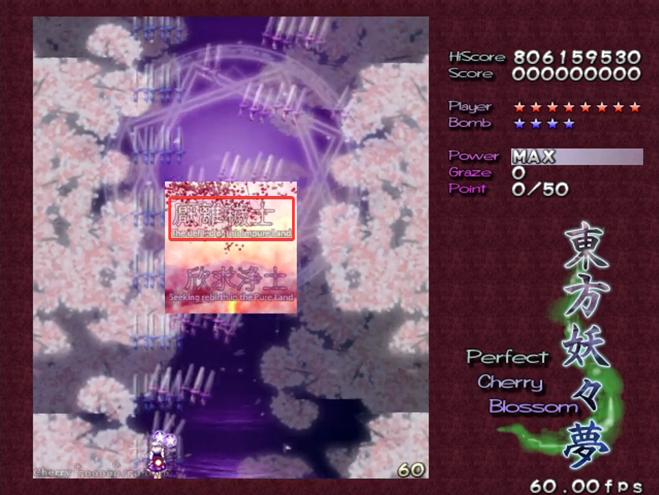
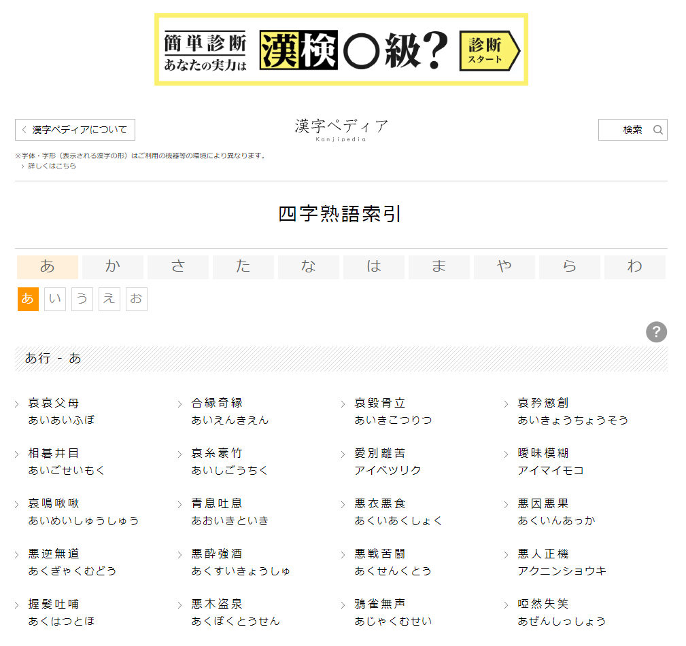

# What are Yojijukugo? + Some Interesting Examples

To me, learning kanji is a gift that keeps on giving. Although it's very daunting at first, what with all the complicated stroke orders and multiple readings per kanji, I believe that with enough perseverance, anyone can eventually get the hang of it.[^1]

[^1]: In my case, I only started to feel "okay" (not *good*, just *okay*) about my kanji abilities after hundreds (thousands?) of hours of study across 2+ years, so it's a pretty *slow* process, all things considered.

## Intro to Yojijukugo

Along your kanji journey, you might encounter scenarios where four kanji appear in a row—for example, consider this sentence: <code>彼女は子供のように**天真爛漫**だった</code>. In this sentence, the four character kanji compound 天真爛漫 is an example of 四字熟語 (よじじゅくご), which literally translates to "four character kanji compound"—very apt!

::: tip
**天真爛漫** (てんしんらんまん) — Innocent and naive ; unaffected. *Used mostly to describe personalities*.
:::

In my opinion, the defining feature of yojijukugo (hence referred to as "yoji") is that the meaning of the yoji is often *more* than the sum of their parts. 

Now, what do I mean by that? Well, something like <code>義務教育</code> is definitely four kanji in a row, but this word is not generally considered to be a yoji. The reason being that 義務教育, which means "compulsory education", can be broken up into **義務**, meaning **duty** or **obligation**, and **教育**, meaning **education**. So the meaning of the entire compound is just the sum of its parts.

As for 天真爛漫, things are a bit different. The first half, **天真**, means **naivete**, and the second half, **爛漫**, means **in full bloom**.[^2] Thus, the sum of the parts is "naivete in full bloom", which is definitely related to the meaning of the yoji, but in my opinion, the relationship isn't as direct as with 義務教育.

[^2]: Unsurprisingly, 爛漫 is quite often (but not always) paired with words related to flowers.

So it isn't the case that every time you come across four kanji in a row, it's a yoji. Instead, yoji have a bit more of a poetic (or idiomatic, or abstract) connection between the meaning of the entire compound and the meanings of the individual kanji.[^3]

[^3]: After writing this introduction, I found out that the [Wikipedia page](https://en.wikipedia.org/wiki/Yojijukugo) on yoji goes over much of the same topics I covered...great minds think alike, I suppose?

If you know Chinese, some yoji may be familiar to you—does <code>粒粒辛苦</code> ring a bell?—, but many yoji are exclusive to Japanese.[^4]

[^4]: The symbol 々 (のま) indicates that the preceding kanji is repeated, so essentially, we have that <code>粒々辛苦 = 粒粒辛苦</code>. Going forward, I'll use 々 when applicable.

## Some Interesting Yojijukugo

With that brief introduction out of the way, I'd now like to look at some (ten, to be exact) yojijukugo that I think are interesting for various reasons. We'll take a look at the meanings of the constituent kanji, and I'll also try to discuss why I personally find the yoji to be interesting.

I came across most of these yoji while studying for the Kanken (see [here](1-tools.md#kanji-kentei-prep-resources) if you don't know what that is). For an exam that tests kanji profiency, it isn't surprising that yoji, which have quite a deep cultural connection with the language, make an appearance. 

In a way, studying yoji is much like learning new proverbs—that's essentially what they are.

### 巧遅拙速 (こうちせっそく)

::: tip
**巧遅拙速** (こうちせっそく) — It's better to be fast and slipshod than to be slow and meticulous.
:::

**Constituent kanji, and their rough meanings:**
* 巧 - adroit, skilled
* 遅 - slow
* 拙 - inexpert, unskilled
* 速 - quick

**Remarks:**

This yoji expresses the idea that rather than taking the time to do something well, it's better to do it quickly, even if that means half-assing it. 

I was quite surprised when I first saw this yoji, because usually, isn't it the other way around?

Normally, we favor doing things slowly and carefully over rushing, but certainly, there are times when speed is valued over quality. Haste does makes waste, but sometimes, that's preferable.

::: warning
**急いては事を仕損じる** (せいてはことをしそんじる) — Haste makes waste ; being in a hurry leads to mistakes [literal translation].
:::

It's interesting to note that the first and third kanji are opposites—巧 vs. 拙—as well as the second and fourth kanji—遅 vs. 速.  Quite a few yoji are of this form, so it might be worth keeping in mind.

### 竜頭蛇尾 (りゅうとうだび)

::: tip
**竜頭蛇尾** (りゅうとうだび) — A strong beginning, but a weak ending ; A dragon's head and a snake's tail [literal translation].
:::

**Constituent kanji, and their rough meanings:**
* 竜 - dragon
* 頭 - head
* 蛇 - snake
* 尾 - tail

**Remarks:**

The actual meaning of this yoji is *very* different from the constituent kanji, wouldn't you agree? Note that the provided literal translations simply string together the constituent kanji, and in most cases do not actually relate to the idiomatic meaning.

Suppose you came across a creature with a dragon's head and snake's tail—it starts off impressively, but the ending may leave more to be desired.

I also think it's interesting how here, it's implied that snakes are inferior to dragons (reasonable, I suppose).

### 鶏口牛後 (けいこうぎゅうご) 

::: tip
**鶏口牛後** (けいこうぎゅうご) — Better to be a big fish in a little pond than a little fish in a big pond ; A chicken's mouth and a cow's behind [literal translation].
:::

**Constituent kanji, and their rough meanings:**
* 鶏 - chicken
* 口 - mouth
* 牛 - cow
* 後 - behind, later

**Remarks:**

Here's another animal-themed yoji. It expresses the notion that rather than being in an insignificant role in a large organization, it is instead preferable to be in an important position (leader, etc.) of a small organization.

The first half, **鶏口**, means **chicken's mouth**, and refers to being a superior in a small organization, whereas the second half, **牛後**, means **cow's behind**, and refers to being a subordinate in a large organization—cows are larger than chickens, after all.

This yoji is often used in business settings and the like, where it has a positive connotation.

### 夏炉冬扇 (かろとうせん)

::: tip
**夏炉冬扇** (かろとうせん) — The wrong tool for the job ; A hearth in the summer and a fan in the winter [literal translation].
:::

**Constituent kanji, and their rough meanings:**
* 夏 - summer
* 炉 - hearth
* 冬 - winter
* 扇 - fan

**Remarks**:

This yoji expresses the idea that an object is not useful, because it isn't the right time or scenario to use it—much like a hearth in summer, or a fan in winter.

I find this yoji interesting because it has very strong visual imagery. A lot of yoji can be quite abstract, but in this case, I find it easy to picture someone sitting next to a fireplace in the blazing summer heat, or someone fanning themselves when it's below zero degrees.

This yoji is often used to imply that something is useless or serves no purpose, in which case it has a negative connotation.

### 呉越同舟 (ごえつどうしゅう)

::: tip
**呉越同舟** (ごえつどうしゅう) — Enemies/rivals working together to achieve a common goal ; A Wu person and a Yue person in the same boat [literal translation].
:::

**Constituent kanji, and their rough meanings:**
* 呉 - ancient Chinese state of Wu
* 越 - ancient Chinese state of Yue
* 同 - same
* 舟 - boat

**Remarks:**

This yoji expresses the idea of enemies finding themselves in a situation where they have to work together to achieve a common goal. Think about how in *Toy Story*, Woody and Buzz have to work together in order to return to Andy after becoming lost.[^5]

[^5]: Personally speaking, I feel like this "enemies working together" concept shows up quite often in children's movies.

The literal meaning of the kanji is that a person from the ancient Chinese state of Wu and a person from the ancient Chinese state of Yue, two rival states, find themselves in the same boat, and presumably have to work together to survive, or something like that.

In most other contexts, the kanji **呉** means **give**, and the kanji **越** means **surpass** or **exceed**, but for this yoji, they take on different meanings.

### 万緑一紅 (ばんりょくいっこう)

::: tip
**万緑一紅** (ばんりょくいっこう) — One thing standing out amongst many things ; A single red in a sea of green [literal translation].
:::

**Constituent kanji, and their rough meanings:**
* 万 - ten thousand
* 緑 - green
* 一 - one
* 紅 - red

**Remarks:**

There's quite a few yoji that have numbers in them, and 万緑一紅 is one such example. It expresses the idea of something striking or special standing out amidst a uniform background—imagine a single red flower in a vast green field.

Like with 夏炉冬扇, this yoji has strong visual imagery, which makes it relatively easy to remember.

### 籠鳥恋雲 (ろうちょうれんうん)

::: tip
**籠鳥恋雲** (ろうちょうれんうん) — Longing for freedom when tied down ; A caged bird longs for the clouds [literal translation].
:::

**Constituent kanji, and their rough meanings:**
* 籠 - cage
* 鳥 - bird
* 恋 - love, yearn
* 雲 - cloud

**Remarks:**

The rest of the yoji which I'll be covering here have a bit of an emotional (melodramatic?) tinge to them. In this case, we have the visual imagery of a caged bird longing for the open sky and the clouds, which is similar to the idiomatic meaning.

...I don't really have much else to say about this one, as I think it explains itself pretty well.

### 飛花落葉 (ひからくよう)

::: tip
**飛花落葉** (ひからくよう) — The impermanence of things in a constantly-changing world.
:::

**Constituent kanji, and their rough meanings:**
* 飛 - fly (the verb, not the insect)[^6]
* 花 - flower
* 落 - fall
* 葉 - leaf

[^6]: If you're looking for **fly** as in the insect, it's **蝿**.

**Remarks:**

This yoji expresses the idea that in this ever-changing world, nothing is forever, which is likened to falling leaves and blossoms scattering in the wind. and If I had to describe the mood of this yoji, adjectives that come to mind include *profound*, *poetic*, *somber*, and so on.

I think this is a really beautiful yoji, because the literal meanings of the kanji give rise to a visual image that is deeply related to a very abstract concept.

To go with the feel of this yoji, here's a fun(?) adjective you might not know: **儚い** (はかない), meaning **fleeting** or **ephemeral**. The next yoji coming up is also of a similar vibe...

### 会者定離 (えしゃじょうり)

::: tip
**会者定離** (えしゃじょうり) — Those who meet must inevitably part.
:::

**Constituent kanji, and their rough meanings:**
* 会 - meet
* 者 - person
* 定 - determine
* 離 - detach, separate

**Remarks:**

This yoji originates from Buddhism, and is in some ways a metaphor for the impermanence of life, not unlike the previous yoji. In this case, people (者) who meet (会) will inevitably (定) have to separate (離). I wrote above that **定** means **determine**, but the usage in this yoji is closer to **inevitable**, although that's not the *main* meaning of this kanji.

I think the point of this yoji is to recognize that our present relationships and way of life won't last forever, encouraging us to gain a deeper appreciation for what we have.

As a bonus, here's a yoji which communicates a very similar concept, also originating from Buddishm.

::: tip
**生者必滅** (しょうじゃひつめつ) — All living things must die.
:::

### 厭離穢土 (えんりえど)

::: tip
**厭離穢土** (えんりえど) — Detesting this impure world.
:::

**Constituent kanji, and their rough meanings:**
* 厭 - detest
* 離 - detach, separate
* 穢 - dirty, impure
* 土 - soil, earth

This somewhat edgy yoji also originates from Buddhism, and describes a Buddhist concept where the earthly world is seen as impure, in contrast to the "Pure Land".

My connection with this yoji is a bit deeper than with the others—I actually first came across this yoji in a video game! More specifically, it makes an appearance near the end of *東方妖々夢 ~ Perfect Cherry Blossom*, the seventh installment in the *[Touhou Project](https://en.wikipedia.org/wiki/Touhou_Project)* franchise.[^7]

[^7]: In addition to the colorful cast of characters and intricate bullet patterns, Touhou Project also features a *lot* of mythology and cultural elements, which includes many, *many* references to Buddhism and the Shinto religion.

The other yoji present in the image, 欣求浄土, is often paired with 厭離穢土, and expresses the idea of desiring rebirth in the Pure Land (because the earthly world is impure). So here's another bonus yoji!

::: tip
**欣求浄土** (ごんぐじょうど) — Seeking rebirth in the Pure Land.
:::

## Final Thoughts

So, did you find any of those yoji interesting? In this post, I only covered but a tiny fraction of all the yoji out there, so even if nothing here particularly hit the spot, I'm sure you'll eventually stumble across something that'll tickle your fancy.

If you want to explore more yoji, I highly recommend you check out the [Kanjipedia](https://www.kanjipedia.jp/sakuin/yojijyukugo/%E3%81%82) yoji index. Sorting is by the initial hiragana, and clicking on a yoji leads to a page where its definition is given in Japanese.

In my experience, when coming across a new yoji, guessing how it's pronounced is not as hard as it might initially seem. The reason being that the kanji comprising a yoji are almost always read with their 音読み (おんよみ), or their Chinese-derived reading, and most kanji have only one or two *main* onyomi.[^8]

[^8]: Of course, there may be other readings that are less commonly used.

Unfortunately, I would have to say that getting into learning yoji does require a pretty strong foundation in kanji—it's certainly not something I could recommend in good faith to a complete beginner or something at an early stage.

If you still find kanji confusing, keep at it! Eventually, the pieces will fall into place. And who knows? Maybe then, you'll become a yoji freak like me.

That's all for now! I don't yet have an idea for the next post, but please look forward to it.

### Image Sources

From the top image, going down:
* いらすとや,
* 東方妖々夢 ~ Perfect Cherry Blossom,
* 漢字ペディア.