# Beyond the JLPT: Japanese Language Exams

So, when it comes to Japanese language exams, the most well known is definitely the Japanese Language Proficiency Test, or [JLPT](https://www.jlpt.jp/e/). The JLPT is intended for non-native students of Japanese, and comes in five levels, from N5 (the easiest) to N1 (the hardest).

Those of you reading this blog are likely aware of the JLPT and its examination scope, covering vocabulary, grammar, reading, and listening. Passing N2 or N1 is an admittedly impressive feat, and can potentially help with finding a job in Japan, among other perks.

Historical [data](https://web.archive.org/web/20170517222952if_/http://www.studytoday.com:80/JLPT.asp?lang=EN) indicates that passing the hardest level of N1 takes around 4,000 hours of study for students with no previous exposure to kanji, but I've also heard that the test has been getting harder recently, so one's mileage might vary.[^1]

[^1]: That's just what I've heard, and I don't actually know if it's true or not.

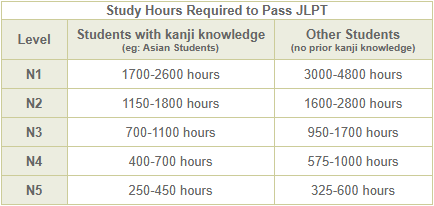

## Downsides of the JLPT

While the JLPT is the most widely known and recognized Japanese language exam, there are, in my opinion, some flaws with the format. My biggest gripe with the JLPT is that it only tests input (reading and listening) and not output (speaking and writing).

This skewed focus on testing input means that people who are especially strong in reading and listening could pass an advanced level such as N1 or N2, but may possess speaking and writing skills much weaker than one might expect from an N1 or N2 passer.[^2]

[^2]: I fear that I will soon become one of these people...I really ought to work on my speaking and writing.

The second flaw that I think the JLPT has is its low passing grade. As can be seen in the table below, to pass N5, one only needs <code>80/180 = 44%</code> to pass. That is a *disastrously* low passing grade, in my opinion.

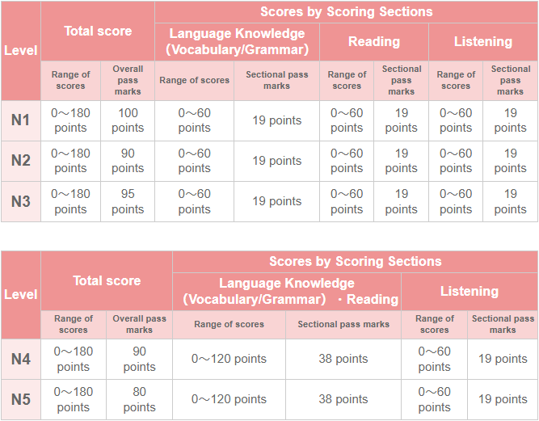

The hardest level of N1 requires <code>100/180 = 56%</code> to pass, which I think is still quite low. So you can get *a lot* of questions wrong on the JLPT and still pass, which calls into question how impressive it is to pass N1 or N2.[^3]

[^3]: On the other hand, getting 満点, or full marks, is a markedly more difficult task, and is (in my opinion) quite the feat.

Thirdly, I think that the question format is not ideal. Every single question is multiple choice, with four answers to choose from—remember how the pass rate for N5 is only 44%? So basically, random guessing, which should net you around 25%, would get you more than halfway to a passing grade...

In my opinion, it would be ideal to either increase the number of answers or introduce short answer questions, but I assume it'd be a logistical pain when it comes to grading, so I really don't see the exam format changing any time soon in this regard.

The fourth and final issue I'd like to bring up has to do with the examination time—it's too long. The easier levels are better in this regard, clocking in at around 1.5 to 2 hours, but the N1 is almost *three* hours.[^4] Not even my university finals are that long! 

[^4]: See [here](https://www.jlpt.jp/e/guideline/testsections.html) for more info on the JLPT format and test duration.

While I do think it's better to have a longer exam and more questions so that the test can be more comprehensive, at this point, it starts to sound more like a marathon than a Japanese exam.

So, with that mini-rant out of the way, I'd now like to discuss some other Japanese language exams, which are a lot less well-known than the JLPT. Perhaps one reason why they aren't so well known is that while the JLPT is for non-native Japanese students, these exams are intended for Japanese natives.

In what's to come, we'll be taking a look at the following Japanese exams:
* The [Kanji Kentei](https://www.kanken.or.jp/kanken/) (漢字検定),
* The [Nihongo Kentei](https://www.nihongokentei.jp/) (日本語検定), and
* The [Kotowaza Kentei](https://kotowaza-kentei.jp/) (ことわざ検定).

For each exam, I'll go over the test format, types of questions, interesting features, etc.[^5] I think this'll be quite interesting, so please bear with me!

[^5]: I haven't yet taken any of these exams myself (including the JLPT), but I have plans to take the N1 this December, followed by the Kanken 2級 in January.

## Kanji Kentei (漢字検定)

I've decided to start off with the exam which I'm the most familiar with, namely the [Kanji Kentei](https://www.kanken.or.jp/kanken/) (漢字検定, or **Kanken** for short). As I've mentioned in previous posts, the aim of the Kanken is to test mastery of kanji. 

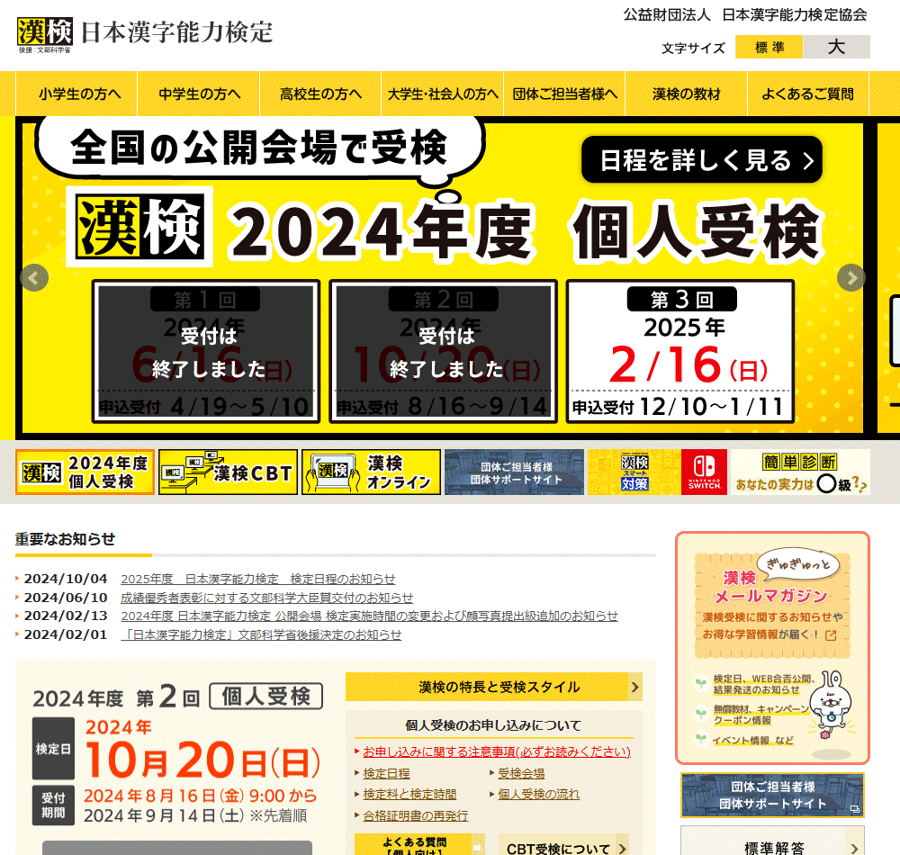

The levels, or **Kyu**s (級), range from 10級 (the easiest) to 1級 (the hardest). There's actually 12 levels, because there are also the 準2級 (Pre-2) and 準1級 (Pre-1) levels. Up to and including 2級, the examinable kanji are all [常用漢字](https://en.wikipedia.org/wiki/J%C5%8Dy%C5%8D_kanji) (Jouyou), with 2級 testing all 2136 Jouyou kanji.

After that point, things get a bit wild—the hardest level of 1級 tests over six thousand kanji, which is a *lot*, to say the least.

Unlike the JLPT, the Kanken is a much shorter exam. According to the Kanken [website](https://www.kanken.or.jp/kanken/group/), exams are either 40 or 60 minutes, depending on the level. But that isn't to say that there aren't a lot of questions. 

Also, pass rate isn't anything to scoff at, either—the passing grade from 10級 to 準2級 is 70%, and from 2級 onwards, it's 80%. Well, that's certainly a step up from the JLPT.

Test sections vary depending on the level, but for the 2級, which is the level that I'm most familiar with, there are nine sections:
1. Readings of kanji (読み),
2. Radicals (部首),
3. Formations of kanji compounds (熟語の構成),
4. Yojijukugo (四字熟語),
5. Antonyms & Synonyms (対義語・類義語),
6. Kanji with the same spelling (同音・同訓異字),
7. Correcting incorrect kanji usage (誤字訂正),
8. Okurigana (送り仮名), and
9. Kana-to-kanji conversion (書き取り).

The easier levels also have sections dedicated to testing stroke orders (筆順) of kanji, but the harder levels assume you have stroke orders down pat.

The test itself is printed double-sided on a large sheet of paper,[^6] and answers are written on a separate answer sheet, of similar size.

[^6]: Doesn't it kind of look like a restaurant menu? Or is it just me?

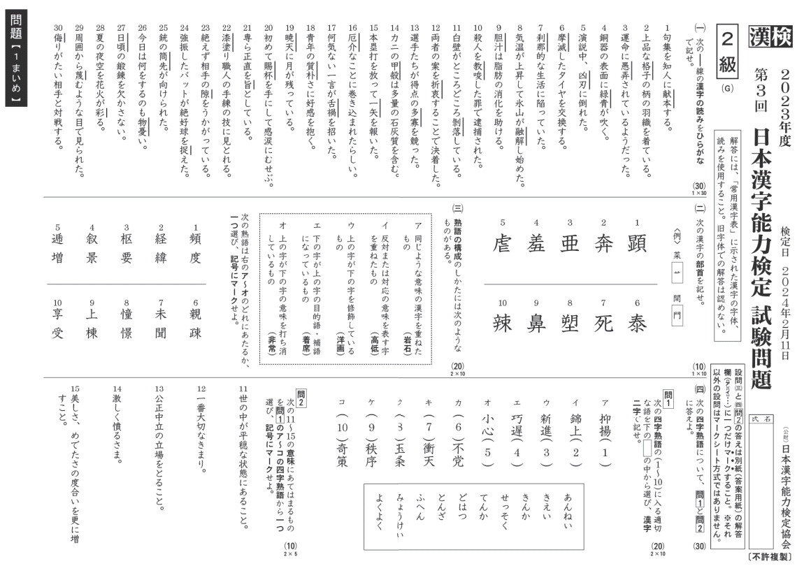

Question formats are either short answer (in kana and kanji) or multiple choice. For short answer questions, it is imperative that you write your kanji neatly—the grading is quite strict about this!

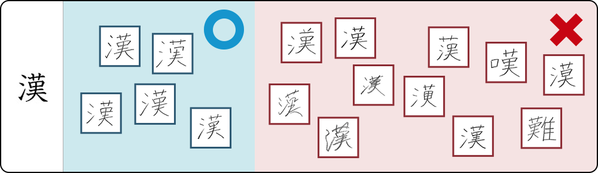

When writing kanji, ensure that the number of strokes is correct, that the relative placements of radicals/parts are correct, and that the kanji are written in block script, not cursive. And make sure that kana in answers are clearly recognizable as well!

The Kanken is fairly well known in Japan, and is a great way—especially for non-native students—to show that they are serious about their studies in Japanese. Personally, I'd like to someday pass 2級, which is supposedly the highest level that most Japanese native test-takes reach.

By the way, if you happen to be situated near or in Canada's Metro Vancouver region, do I have good news for you! 

Metro Vancouver is home to Canada's only Kanken test-taking location, provided courtesy of Burnaby's [Gladstone Japanese Language School](https://www.gladstonejls.com/kanji/). There's also the option to take the Kanken online, via their Computer-Based Testing (CBT) system, but I'm not sure if this alternative is available outside of Japan.

All things considered, the Kanken is a great challenge for those looking to improve their kanji abilities.

## Nihongo Kentei (日本語検定)

The next exam we'll be looking at is the [Nihongo Kentei](https://www.nihongokentei.jp/) (日本語検定), which tests Japanese knowledge in the areas of:
* Kanji (漢字), 
* Orthography (表記), 
* Keigo (敬語), 
* Word usage (言葉の意味), 
* Vocabulary (語彙), and 
* Grammar (文法). 

There are also "mixed" questions (総合問題), which are more involved, and may require examinees to interpret graphs, figures, etc.

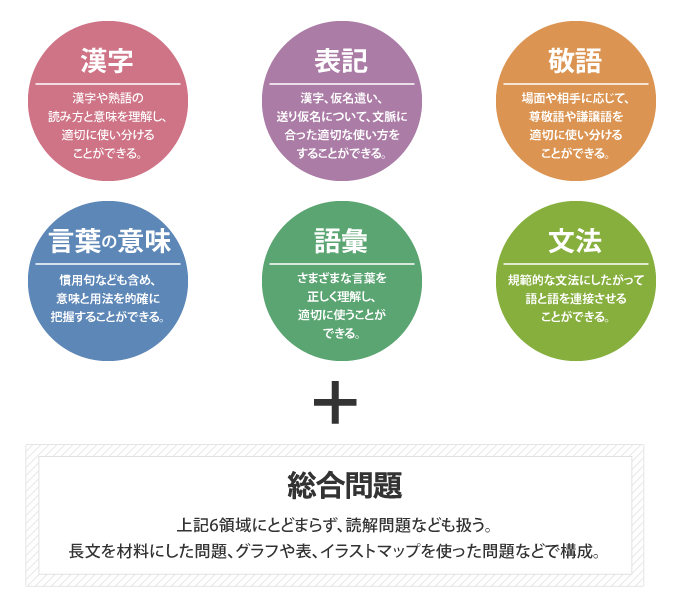

Like the Kanken, levels are called Kyus (級), and range from 7級 (the easiest—intended for 2nd graders) to 1級 (the hardest—intended for working adults). 

Test venues are found all across Japan, with a location in every prefecture. Unfortunately, it isn't possible to take the Nihongo Kentei outside of Japan.

Exams are either 50 or 60 minutes, depending on the level. To pass, a candidate must have achieved at least 50% in each of the six sections, and must also achieve a total grade of 70% to 80%; the more difficult levels have higher passing requirements.

In terms of what the questions are like, you can try out past exam questions [here](https://www.nihongokentei.jp/check/) on the Nihongo Kentei website.

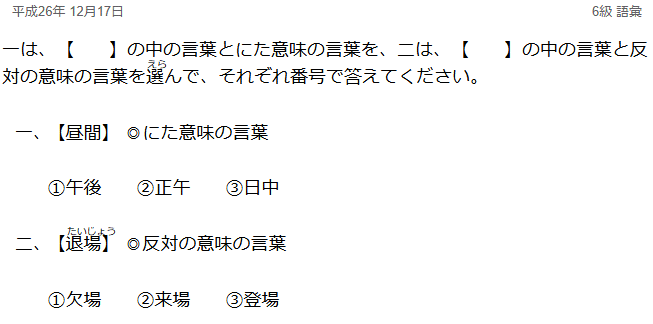

The question above is from vocabulary for the 6級 exam, and asks examinees to first select the option which is most similar in meaning to 昼間, then the option which is opposite in meaning to 退場.

I won't give the answers here, but if you follow the link, all the questions have answers, with explanations.

Unlike the Kanken, which I'm actively studying for, I haven't looked into studying for the Nihongo Kentei—mostly because there's no way (currently) for me to sit the exam! Despite that, I was able to find some [prep books](https://www.amazon.co.jp/-/en/%E6%97%A5%E6%9C%AC%E8%AA%9E%E6%A4%9C%E5%AE%9A%E5%A7%94%E5%93%A1%E4%BC%9A/dp/4487809924/) on Amazon.jp.

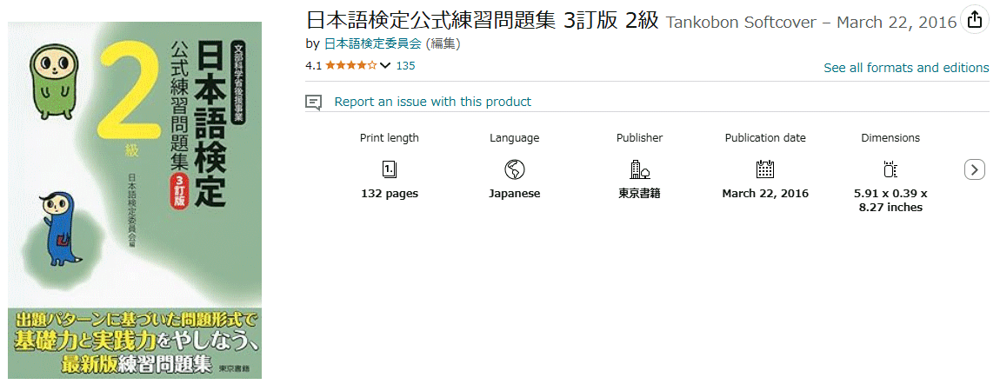

To end off this section, I leave you with the following past exam question, from the 2級 kanji section. How well do you know your kanji? These ones are pretty advanced.

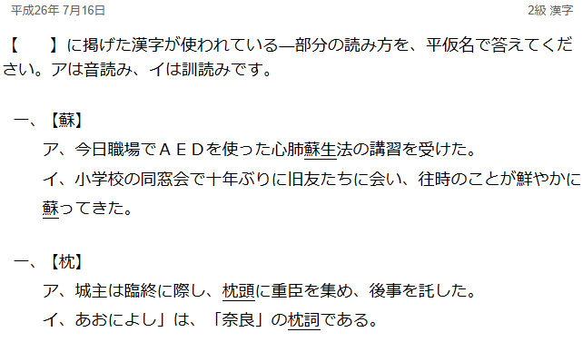

## Kotowaza Kentei (ことわざ検定)

The last Japanese language exam which I'd like to cover here is the [Kotowaza Kentei](https://kotowaza-kentei.jp/) (ことわざ検定, or Kotoken), which tests knowledge of Japanese sayings, idioms, and proverbs. 

You might be surprised that this kind of exam even exists, but I get the impression that the Japanese like their tests, so perhaps it's not all that surprising.

The homepage is clearly designed for a younger audience, which reflects how the easier levels are geared towards children and adolescents, similar to the Kanken.

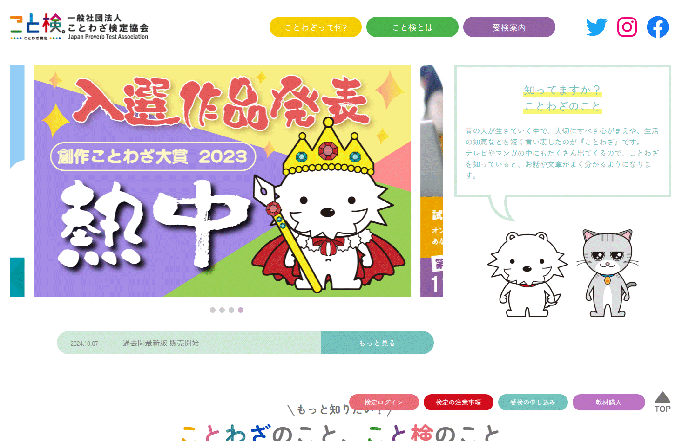

Personally, I actually think that it's quite important for Japanese language learners to have good fundamentals in sayings and proverbs. Not only will you be able to further learn and immerse in the culture[^bignote], but knowing your idioms will help when it comes to consuming native content, and it also shows that you're well-learned and serious about your Japanese.

[^bignote]: Like in English, many sayings and idioms have interesting cultural origins, or 由来. For example, the kotowaza <code>食指が動く</code>, which translates roughly as <code>to have a craving for</code>, has the following origin: 

    There was a duke in ancient China, who, when expecting a delicacy, would have his finger twitch unknowingly. His servants would laugh at this habit, much to his displeasure. In some versions of the story, an altercation broke out, and the servants ended up killing the duke.

Like the Kanken and the Nihongo Kentei, levels are called Kyus (級), and they range from 10級 (the easiest) to 1級 (the hardest). Unlike the Kanken, there are no Pre- (準) levels. 

Examination times are either 40 or 50 minutes, and the passing rate is either 70% or 80%—the harder levels get more time, and have higher passing grades. The easiest level, 10級 is described as suitable for children in early elementary school, 3級 is for the average adult, 2級 is for adults at a "high level", whatever that means, and 1級 is for kotowaza masters.

The Kotoken is held a handful of times every year, and can be taken online or in person. Again, I don't believe it's possible to take the Kotoken outside of Japan.[^8]

[^8]: If I've happened to make any misstatements, please let me know! You can get in touch with me via Discord at <code>nootnoot4900</code>.

Below is an example 10級 exam. That's a cute drawing, isn't it? More example exams can be found [here](https://kotowaza-kentei.jp/about/) (warning: entirely in Japanese).

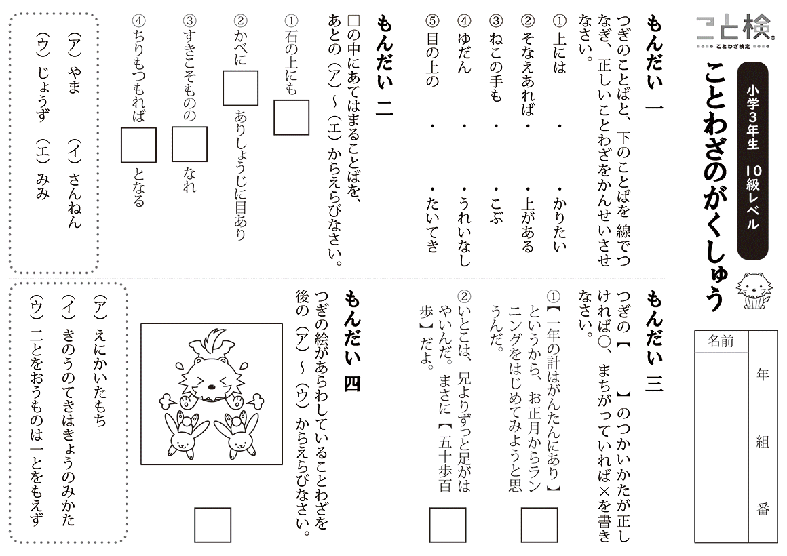

There's a lion (?) trying to chase two rabbits, which is in reference to the Japanese saying <code>二兎を追う者は一兎をも得ず</code>. Ah, darn, I've just spoiled the question!

::: warning
**二兎を追う者は一兎をも得ず** (にとをおうものはいっとをもえず) — One who chases after two rabbits will catch neither.
:::

The figurative meaning is that one shouldn't get distracted working on multiple tasks—in that case, neither of them may end up going well.

If you want to try learning some of the proverbs that appear on this exam, look no further than Bret Mayer's "[Kanji Stuff]"(https://www.bretmayer.com/kanji.html) website, which I also featured in the very first blog post! In particular, the resources in the <code>ことわざ・Proverbs/Sayings</code> section have kotowaza listed out by Kotoken level, with the kanji, readings, English translations, and explanatory comments provided. 

I've made Anki decks for all the 10級 and 9級 kotowaza, and am looking to continue cramming more in the future, though I'm not sure if I'd ever take the test. But as I previously mentioned, learning sayings and proverbs has many more uses than just passing an exam.

## Closing Remarks

Thanks for sticking around until the end!

In this blog post, we took a look at Japanese language exams beyond the JLPT, noting their differences and similarities to each other. 

One aspect which I find really interesting is that all three of the exams we looked at had their easy levels targeted towards children, but I'd wager that most people don't get that kind of impression for the JLPT.

Another interesting point is that all the exams had test times much shorter than those of the JLPT, and they also had significantly more stringent passing requirements. But at the end of the day, the JLPT is the most well known Japanese language certification out there, so I've got to put some respect on the name.

For the next post, I plan to cover vocabulary, specifically, calendar expressions and divisions of time. I think it'll be pretty interesting, so please wait warmly while I get that written up...or who knows, maybe I'll change my mind at some point.

Thanks for reading, and have a good one!

### Image Sources

From the top image, going down:
* Japan Language Education Center,
* Japanese Language Proficiency Test,
* 漢検 (日本漢字能力検定),
* 問題例 | 漢検の概要 | 日本漢字能力検定,
* 漢検の採点について | 日本漢字能力検定,
* 日本語検定とは？｜日本語検定,
* 検定問題に挑戦！｜日本語検定,
* Amazon.jp,
* 検定問題に挑戦！｜日本語検定,
* こと検 -ことわざ検定-,
* 検定について | こと検 -ことわざ検定-.
